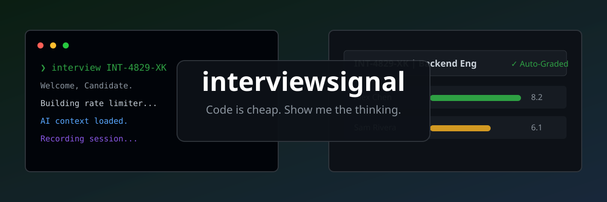
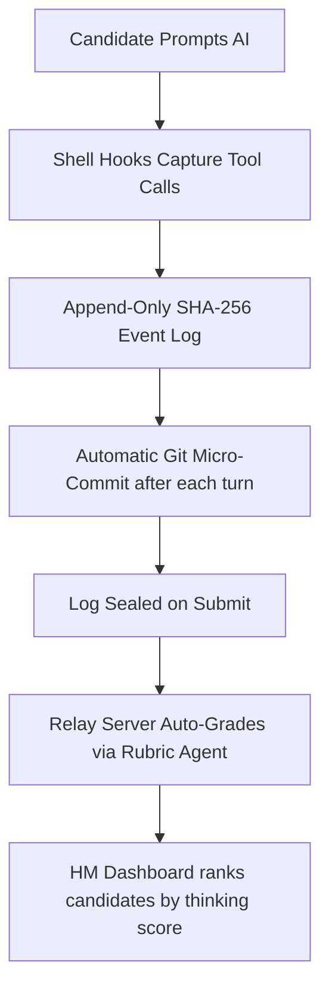

<div align="center">
  <!-- HERO BANNER -->
  
  
  <br/>
  
  <h1>🤖 interviewsignal</h1>
  <h3>The Premium, Open-Source Developer Screening Platform for the Cursor & Claude Era</h3>
  
  <p><strong>100% Free · 100% Self-Hosted · 100% Private</strong></p>

[](https://pypi.org/project/interviewsignal/)
[](https://github.com/NikhilSKashyap/interviewsignal)
[](LICENSE)
[](docs/relay-api.md)
[](https://quasappono606366.substack.com/p/code-is-cheap-show-me-the-thinking)

</div>

---

> [!NOTE]
> ### 🚨 Code is Cheap. Show Me the Thinking.
> When every developer uses Cursor, Claude, and Gemini, code quality converges. Traditional take-home assessments don't screen for skill—they screen for copy-paste speed. **Output is no longer a signal.**
>
> **interviewsignal** is a professional, open-source developer screening framework built around the philosophy that **code is cheap, but deep engineering thinking is priceless**. We don't just grade *if* the code works; we grade *how* the candidate works with AI: how they decompose complex problems, instruct LLMs, debug errors, and verify assumptions.

---

## ⚡ The Ultimate Open-Source LeetCode Alternative

Traditional platforms charge thousands of dollars for invasive proctoring tools that candidates hate. `interviewsignal` turns AI usage from a liability into a **premium screening signal**—completely free and running on your own infrastructure.

```
                           THE INTERVIEWSIGNAL WORKFLOW
                           
  [ Candidate CLI ]  ──>  [ Hash-Chained Log ]  ──>  [ AI Rubric Grading ]
   Runs locally in         Secures prompts, tools    Grades architectural thinking
   their native IDE        and git-state diffs       using your own LLM rubrics
```

### Why Engineering Teams Choose interviewsignal

* **🏆 Real-World AI Collaboration:** Candidates work in their local IDE (Claude Code, Gemini, Cursor) with full-power AI. That's the real job.
* **🛡️ Tamper-Proof Cryptographic Hash Chain:** Every prompt, tool call, shell command, and file modification is signed and hash-chained. Any attempt to modify logs or inject offline code breaks the verification chain.
* **📊 Process-Based AI Rubrics:** Automatically ranks candidates based on the quality of their prompt engineering, verification strategies, and failure recovery.
* **🔒 100% Private & Self-Hosted:** No vendor contracts, no third-party tracking. Run it on a $5/mo Railway instance or host it completely inside your private VPC.

---

## 📊 The Open-Source Alternative to High-Priced Proprietary Platforms

Proprietary AI technical assessment platforms (such as OpenRound.ai) have validated that grading candidate process and AI fluency is the future of hiring—but they charge hundreds of dollars a month and strictly limit assessments (e.g., Starter tiers charging **$449/mo** or **$129/seat** while offering **only 5 assessments/month**).

`interviewsignal` offers a professional, modern, and completely unrestricted open-source alternative.

| Feature | 🤖 interviewsignal (Open-Source) | 🏢 Proprietary SaaS (e.g., OpenRound) |
| :--- | :--- | :--- |
| **Pricing** | **100% Free Forever** | **$449+/mo** or high seat licensing fees |
| **Assessment Volume** | **Unlimited** (Screen 10 or 1,000 candidates at no extra cost) | Strictly metered (typically **only 5 to 20** assessments/mo) |
| **Data Privacy & Telemetry** | **100% Private & Self-Hosted**. Zero tracking. Runs inside your VPC. | Multi-tenant SaaS cloud. Session logs sent to third-party. |
| **Candidate Environment** | Work in their local native IDE (Claude Code, Gemini CLI, Cursor, Aider). | Sandboxed browser interfaces or proprietary VMs. |
| **Customization** | Completely customizable. Modify LLM grading rubrics, prompts, and CLI skills. | Standardized rubrics, customization locked behind enterprise tiers. |
| **Vendor Lock-in** | **Zero**. You own your relay, your transcripts, and your rubrics. | High. Bound to proprietary seat limits and contracts. |

---

## 💎 Premium Features, Zero Price Tag

We believe world-class developer screening should be accessible to every engineering team.

### 🔗 Cryptographically Verified Process
Every prompt, tool call, and file state change is appended to a tamper-evident ledger and secured by SHA-256 hash chains. Candidates have complete control over their local environment, while you get total visibility without invasive browser-locking plugins.

### 🤖 Custom AI-Native Rubrics
Grade submissions automatically using your own API keys. You configure the parameters—decide if you value architectural foresight, prompt precision, test coverage, or debugging speed, and let the grading agent analyze the session ledger.

### 🛠️ Self-Hosted Relay Server
A lightweight, zero-dependency Python relay stores interview packages and session logs. Launch in one click on Railway or run via Docker. It supports GitHub OAuth out-of-the-box to enforce a strict *one account = one submission* policy.

---

## 🚀 Quickstart in 60 Seconds

### 1. Hiring Managers — Create an Assessment

Create an interactive assessment instantly. Our CLI will guide you through setting up your problem statement, grading rubrics, and time limits:

```bash
pip install interviewsignal
interview dashboard
```
*This launches the local review dashboard at `http://localhost:7832`. Create an assessment to get your unique session code (e.g., `INT-LEO-90210`).*

### 2. Candidates — Take the Interview

Candidates run a secure, logged session directly inside their development terminal:

```bash
pip install interviewsignal && interview install
interview start INT-LEO-90210
```

1. **GitHub OAuth Verification:** Ensures identity and prevents multiple submissions.
2. **AI Skill Activation:** Auto-configures the local AI agent (Claude Code, Gemini, etc.) with interview capture hooks.
3. **Execution:** The candidate solves the problem naturally.
4. **Sealing the Deal:** When ready, running `interview submit` packages the cryptographically verified event stream and pushes it to the relay.

---

## ⚙️ How It Works: Under the Hood

`interviewsignal` hooks directly into the developer's terminal agent. As the candidate interacts with the AI, a structured ledger captures the entire cognitive process.



### Tamper-Evident Session Analytics

We analyze the interaction stream across **9 distinct dimensions** to highlight high-value candidates and flag suspicious submissions:

* **🚨 Tamper Flags:**
  * `Gapped History`: Detects periods where event capture hooks were deactivated.
  * `Ghost Edits`: Code modified without any corresponding AI write or edit tool calls (offline copy-pasting).
  * `Commit Mismatches`: Discrepancies between the local git micro-commits and recorded prompt history.
* **📈 Behavior Indicators:**
  * `High-Leverage AI Direction`: Candidate proactively instructs, critiques, and guides the AI.
  * `Silent Copy-Paster`: Candidate accepts AI code blindly without reviewing, running tests, or iterating.
  * `Iterative Debugging`: Strong signals of verifying test failures and iterating until correct.

---

## 🎯 Search Engine Optimization (SEO) & Long-Tail Capture

To capture organic search traffic from CTOs, VPs of Engineering, and Talent Acquisition leaders, `interviewsignal` is optimized for high-intent queries:

### FAQ — Frequently Asked Questions

#### How do we prevent candidates from using a second laptop to get AI answers?
While physical screen proctoring is invasive, `interviewsignal` uses **Tamper-Evident Behavioral Analysis**. When a candidate receives pre-written code from another screen, they typically paste massive blocks of finished code into their workspace without a trace of collaborative problem decomposition, trial-and-error, or prompt history. This triggers our `Ghost Edits` and `Zero Prompts` flags, immediately ranking them at the bottom.

#### Can we run this completely offline or in a private network?
Yes! Since `interviewsignal` is fully open source, you can host the relay server inside your own VPC and configure it with your internal proxy or offline LLM gateways. It is built with zero telemetry, zero trackers, and zero external dependencies.

#### What coding platforms are supported?
Out-of-the-box, it integrates perfectly with **Claude Code**, **Gemini CLI**, and **Codex**. We also support skill instruction injections for IDE-based tools like **Cursor** and **Aider**.

---

<div align="center">
  <h3>Ready to see the real signal?</h3>
  <p>Stop filtering out good developers with outdated whiteboard questions. Hire the best AI-collaborators today.</p>
  <a href="docs/ARCHITECTURE.md"><strong>Read the Architecture Docs</strong></a> | <a href="docs/relay-api.md"><strong>Relay API Spec</strong></a>
</div>
