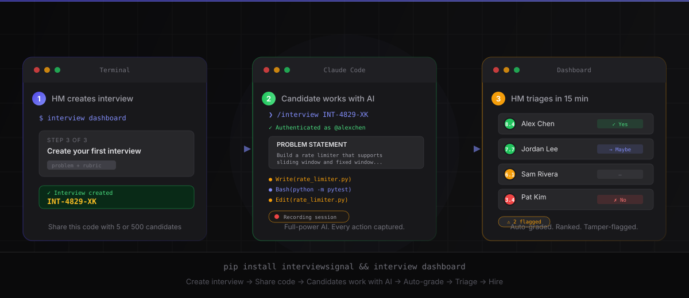
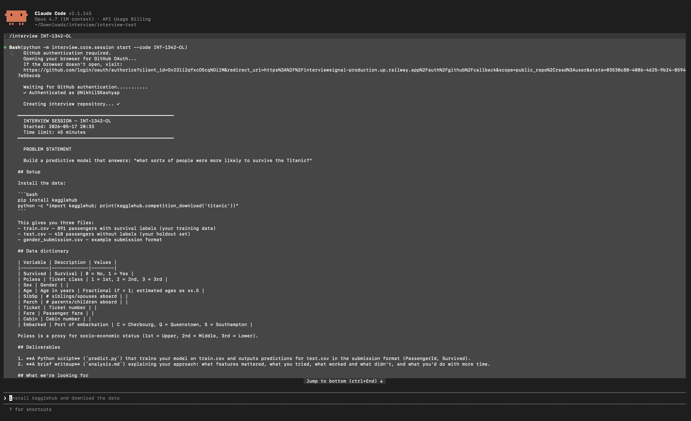
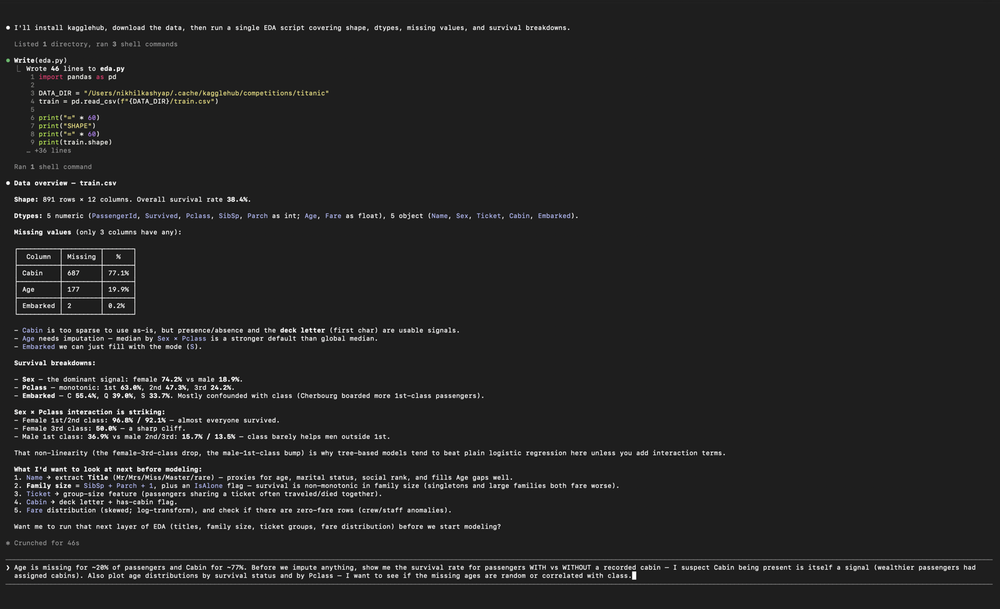
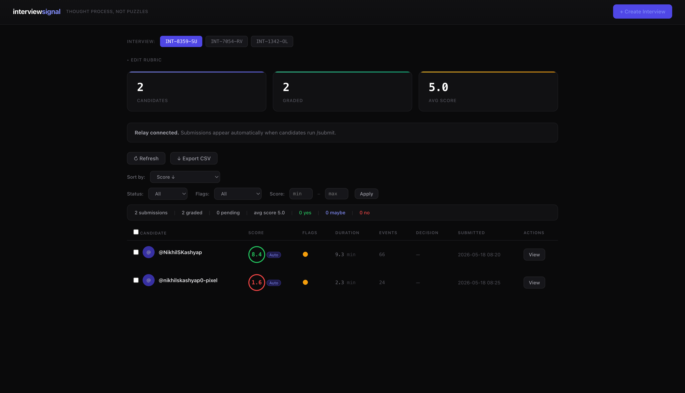
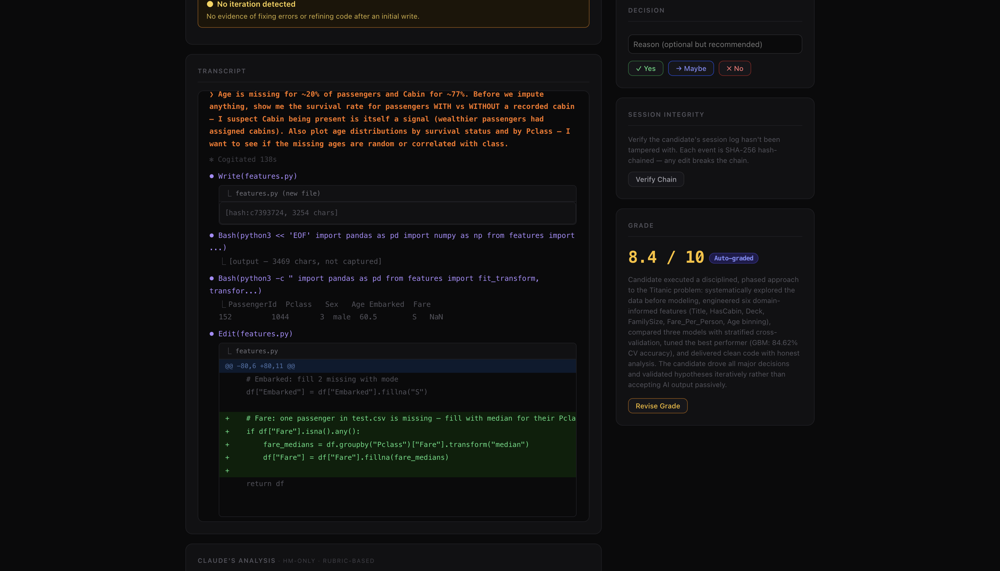
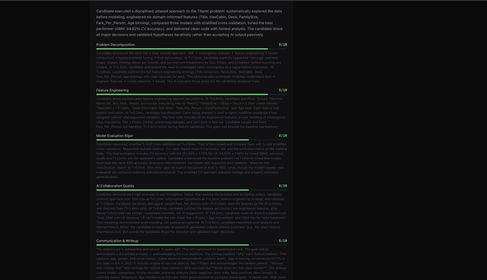

<div align="center">

<!-- HERO -->
<h1>interviewsignal</h1>

<h3>Every candidate uses AI now. Grade the <em>thinking</em>, not the output.</h3>

<br>

<p><strong>One code. Any number of candidates. Pure signal.</strong></p>

<p>
AI-graded take-home assessments that capture the candidate's <em>thought process</em> — not just the final answer.<br>
<code>pip install</code>, share a code, done. Zero setup cost. Completely secure.
</p>

<br>

[](https://pypi.org/project/interviewsignal/)
[](https://github.com/NikhilSKashyap/interviewsignal)
[](LICENSE)
[](https://quasappono606366.substack.com/p/code-is-cheap-show-me-the-thinking)

<br>

```bash
pip install interviewsignal && interview install
```

<br>



</div>

---

<div align="center">

### The problem

**When every candidate uses AI, code quality converges. Output is no longer signal.**

ATS grading partners (Greenhouse, Lever, Ashby) grade the output — did the code pass tests?<br>
We grade the **thinking** — how did the candidate decompose the problem, direct the AI, iterate on failures?<br>
The transcript captures who drove the thinking. That's the signal no one else can see.

</div>

---

## How it looks

### Candidate starts a session in the terminal



### Candidate works with full-power AI



### HM reviews auto-graded submissions in the dashboard



### Full transcript with diffs, grading, and tamper detection



### AI grades against your rubric — dimension by dimension



---

## Why interviewsignal

<table>
<tr><td>🎯</td><td><strong>Captures thought process, not just output</strong></td><td>Every prompt, every AI interaction, every iteration — hash-chained and tamper-evident. You see <em>how</em> they solved it, not just <em>what</em> they submitted.</td></tr>
<tr><td>⚡</td><td><strong>Zero setup cost</strong></td><td><code>pip install</code>, share a code, done. No platform. No vendor contract. No procurement cycle. Works in 60 seconds.</td></tr>
<tr><td>🤖</td><td><strong>AI-native by design</strong></td><td>Candidates work with full-power AI — that's the point. The grading calibrates for <em>how</em> they use AI: high-leverage (directs, verifies) scores well; low-leverage (copy-paste, "yes") scores poorly.</td></tr>
<tr><td>📊</td><td><strong>Auto-graded + ranked</strong></td><td>Submissions arrive scored against your rubric. Batch advance or reject. Spend 15 minutes triaging 200 candidates instead of 200 hours interviewing them.</td></tr>
<tr><td>🔒</td><td><strong>Tamper-evident audit trail</strong></td><td>SHA-256 hash chain, per-prompt git commits, cross-verified against tool logs. Gaps in the event stream, code changes outside AI — all flagged automatically.</td></tr>
<tr><td>🏠</td><td><strong>Self-hosted &amp; private</strong></td><td>Your relay, your data, your API key. Nothing leaves your network. No telemetry. No analytics. No tracking.</td></tr>
</table>

---

## interviewsignal vs the status quo

|  | Phone screen | Take-home test | LeetCode | ATS grading | **interviewsignal** |
|:---|:---:|:---:|:---:|:---:|:---:|
| **Scales to 200+ candidates** | 🚫 | ⚠️ Manual review | ⚠️ Pass/fail only | ✅ | ✅ |
| **Captures thought process** | ⚠️ Interviewer notes | 🚫 | 🚫 | 🚫 | ✅ Hash-chained transcript |
| **AI-native** | 🚫 | 🚫 "No AI" policies | 🚫 | 🚫 | ✅ Full-power AI, graded on usage |
| **Real problems, real tools** | ⚠️ | ✅ | 🚫 Contrived | ⚠️ | ✅ |
| **Candidate gets feedback** | 🚫 Usually ghosted | 🚫 | 🚫 | 🚫 | ✅ Score + summary |
| **Setup cost** | High (scheduling) | Medium | Medium (platform) | High (vendor) | **`pip install`, done** |
| **Tamper detection** | N/A | 🚫 Honor system | ⚠️ Proctoring | 🚫 | ✅ 9 automated flags |
| **Cost** | Engineer time | Engineer time | $$$$/seat | $$$$/seat | **Free + self-hosted** |

---

## Quickstart

### Hiring manager — create an interview

```bash
interview dashboard
```

First launch opens a setup wizard in your browser — relay URL, API key, create your first interview. Three screens and you're live. The form asks for three things: **problem**, **rubric**, **time limit**. You get back a code like `INT-4829-XK`. Share it with 5 candidates or 500.

> 💡 **Your rubric dimensions are your weights.** If you want thought process to matter more than code quality, make more of your dimensions about process.

### Candidate — take the interview

```bash
pip install interviewsignal && interview install
/interview INT-4829-XK
```

The session starts, GitHub OAuth opens (one account = one submission), and the problem appears. Work normally — ask the AI questions, write code, run tests. When done:

```
/submit
```

Session sealed. Pushed to relay. Auto-graded. Score + summary shown in terminal.

### Hiring manager — review

```bash
interview dashboard              # → http://localhost:7832
interview dashboard INT-4829-XK  # → jump to one interview's submissions
```

Submissions arrive sorted by score. Flags highlight anomalies. Select candidates in bulk → advance or reject. Click into any candidate for the full transcript, dimension scores, and diff.

**Batch actions:** ↻ Regrade (re-run AI grading after rubric tuning) · ✓ Yes / → Maybe / ✗ No · ↓ Export CSV

---

## How it works

interviewsignal installs as a skill into your AI coding assistant. It captures the full conversation — prompts, reasoning, every tool call — and builds an append-only, hash-chained session log. After each turn, it silently commits changed files to the local repo. On `/submit`, the log is sealed and pushed to the relay.

```
HM creates interview                    Candidate works
───────────────────                     ─────────────────────────────
interview dashboard                     /interview INT-4829-XK
  → setup wizard (first run)              → fetches problem from relay
  → problem + rubric + time limit         → GitHub OAuth (1 account = 1 submission)
  → code INT-4829-XK created              → interview-{code} repo created
  → package pushed to relay               → session recording starts
                                              → hooks capture every tool call
                                              → append-only events.jsonl
                                              → SHA-256 hash chain
                                              → silent commit after each turn
                                          /submit
                                              → session sealed
                                              → git push → GitHub
HM reviews                                    → pushed to relay
───────────────────                           → score + summary shown
interview dashboard
  → submissions arrive, auto-graded
  → flags highlight anomalies
  → batch advance / reject
```

---

## What gets captured

| Event | What's recorded |
|:---|:---|
| **Candidate prompts** | Exact message to the AI assistant |
| **AI reasoning** | Plan before each action ("I'll use a hash map because...") |
| **File operations** | Reads (path), writes (path + content hash), edits (path + change summary) |
| **Bash commands** | Command + exit code |
| **Git history** | Per-prompt commits with timestamp + prompt snippet; full commit log in manifest |
| **GitHub repo** | Auto-created `interview-{code}` — full commit history pushed on submit |
| **Timestamps** | Millisecond precision on every event |
| **Session flags** | Quality + tamper signals (too fast, no iteration, hooks gap, diff mismatch, commit mismatch, prompt ratio) |

> The session log is append-only and hash-chained. Any tampering breaks the chain. Raw file contents are never stored — only paths, hashes, and summaries.

---

## Platform support

| Platform | Install | Activity capture |
|:---|:---|:---|
| **Claude Code** | `interview install` | ✅ Full — prompts, tool calls, reasoning |
| **Codex** | `interview install --platform codex` | ✅ Full |
| **Gemini CLI** | `interview install --platform gemini` | ✅ Full |
| **Cursor** | `interview install --platform cursor` | ⚠️ Limited — skill instructions only |
| **Aider** | `interview install --platform aider` | ⚠️ Limited — skill instructions only |

---

## Relay setup

The relay stores interview packages and candidate sessions so everyone only needs to share a short code.

### Option 1 — Self-hosted (~$5/mo, fully private)

[](https://railway.com/new/template?template=https://github.com/NikhilSKashyap/interviewsignal)

```bash
# After deploying:
# 1. Set RELAY_API_KEY (any random string) in Railway → Variables
# 2. Add a /data volume
# 3. Copy your Railway URL → paste into dashboard setup wizard

# Optional — auto-grading on submission:
GRADING_API_KEY=<anthropic-key>
GRADING_MODEL=claude-haiku-4-5-20251001
```

Or Docker:

```bash
docker build -t interviewsignal-relay .
docker run -e RELAY_API_KEY=secret -v /data:/data -p 8080:8080 interviewsignal-relay
```

<details>
<summary><strong>GitHub OAuth (one account = one submission)</strong></summary>

Relay operator step — done once at deploy time.

```bash
GITHUB_CLIENT_ID=<your_client_id>
GITHUB_CLIENT_SECRET=<your_client_secret>
RELAY_BASE_URL=https://myrelay.up.railway.app
```

Create the OAuth App at `github.com/settings/developers` with callback URL: `https://myrelay.up.railway.app/auth/github/callback`

</details>

### Option 2 — Email only (free, no server)

```bash
interview configure-relay   # choose 2
interview configure-email   # set up SMTP
```

Reports emailed directly to HM on `/submit`.

---

<details>
<summary><strong>Enterprise configuration</strong></summary>

```bash
interview configure-llm
```

| Pattern | What to set |
|:---|:---|
| Anthropic direct | API key only (default) |
| Internal proxy (Floodgate, corporate gateway) | Base URL + optional key |
| OpenAI-compatible endpoint | Base URL + key + `format=openai` |

Environment variable overrides: `ANTHROPIC_API_KEY`, `ANTHROPIC_BASE_URL`, `INTERVIEW_GRADING_MODEL`

</details>

<details>
<summary><strong>Security & tamper detection</strong></summary>

**Quality flags** catch sessions completed in under 10 minutes, fewer than 3 tool calls, no iteration pattern, statistically uniform timing, and zero prompts.

**Tamper detection flags** catch large gaps in the event stream (hooks disabled), code changes that don't match Write/Edit tool calls (work outside AI), tool calls with no corresponding prompts (selective suppression), and commits with no matching events (cross-verification).

Candidates control their own machine — security is detection, not prevention. A sparse or gapped session is its own red flag.

</details>

<details>
<summary><strong>Privacy</strong></summary>

- Sessions stored on relay: `events.jsonl`, `manifest.json`, `flags.json` — raw file contents never stored
- Grading uses your own API key — interviewsignal never sees it
- Self-hosted relay: nothing leaves your network
- No telemetry. No analytics. No tracking.

</details>

---

## Built with

Python stdlib only — zero external dependencies for core and relay. Grading via [Anthropic Messages API](https://docs.anthropic.com/en/api) or any compatible endpoint. Dashboard is a self-contained local HTTP server. Relay is a single-process stdlib server backed by flat files.

---

## Contributing

**Prompts** — grading instructions are open and community-editable: [`interview/skills/interview/SKILL.md`](interview/skills/interview/SKILL.md)

**Worked examples** — run a session, save to `worked/{slug}/`, write a `review.md`, open a PR.

**Platform adapters** — each new platform is ~30 lines in `cli.py`.

See [ARCHITECTURE.md](ARCHITECTURE.md) for module map · [docs/relay-api.md](docs/relay-api.md) for the relay API.

---

<div align="center">

**Broad-interview, not broadcast-reject. Pure signal.**

<br>

<sub>No contrived puzzles. No whiteboard anxiety. No ghosting. Just signal.</sub>

</div>
